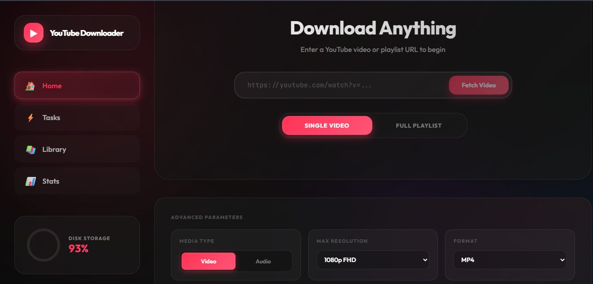
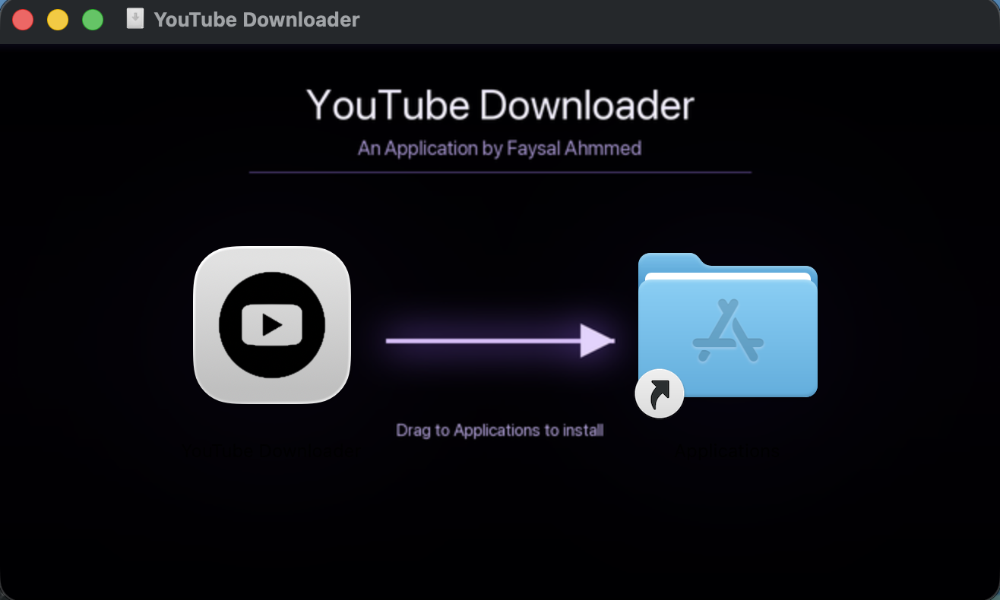
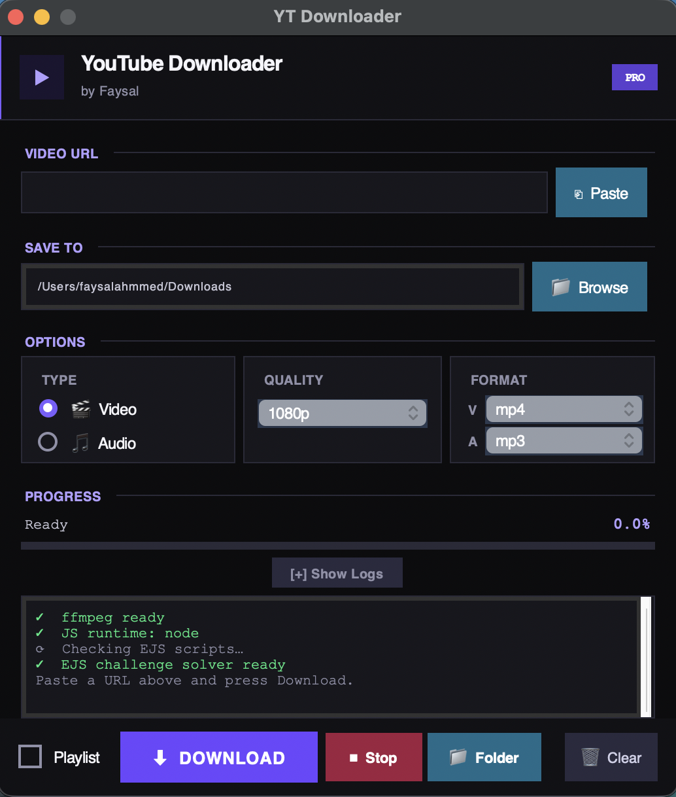

<div align="center">

<h1 align="center">
  
</h1>

<p align="center">
  <b>The ultimate multimedia downloading ecosystem. Featuring a premium Desktop GUI and a mobile-friendly Local Server. Engineered for speed, stability, and intelligent updates.</b>
</p>

<!-- Preview Image -->
<p align="center">
  
</p>

<!-- Preview Image 2 -->
<div align="center">
  <table>
    <tr>
      <td valign="middle">
        
      </td>
      <td valign="middle">
        
      </td>
    </tr>
  </table>
</div>

<!-- Badges -->
<p align="center">
  
  
  
  <a href="https://huggingface.co/spaces/Faysal4200/video-downloader">
    
  </a>
</p>

---

</div>

## 🌟 Executive Summary

This project is a comprehensive solution for downloading content from YouTube and other platforms. It provides two distinct modes of operation:
1.  **Desktop App**: A standalone, high-performance GUI for power users.
2.  **Local Server**: A FastAPI-based backend with a beautiful web UI accessible from any device (Phone, Tablet, PC) on your local network.

---

## 🔥 Key Features & Capabilities

### ⚡ Performance & Core
- **Multi-threaded Downloads**: High-speed downloading using parallel processing.
- **Support for 1000+ Sites**: Powered by `yt-dlp`, supporting almost every major video platform.
- **Smart Formatting**: Intelligent selection of the best available video/audio streams.
- **Automatic Merging**: Bundles high-quality video with high-bitrate audio using `ffmpeg`.

### 🖥️ Desktop Excellence
- **Premium Dark UI**: A modern, sleek interface with glassmorphism and subtle animations.
- **Progress Tracking**: Detailed real-time progress bars including speed, ETA, and file size.
- **Format Flexibility**: Switch between 4K, 1080p, 720p, or extract MP3/M4A audio with a single click.
- **Cross-Platform**: Built to work seamlessly on Windows, macOS, and Linux.

### 🌐 Server & Mobile GUI
- **Local Network Access**: Start the server and access the downloader from your iPhone or Android.
- **SSE Real-time Data**: Visual progress updates on mobile browsers without refreshing.
- **Background Jobs**: Start a download on your PC and monitor it from your phone.
- **Unified Experience**: The same powerful downloading engine, now accessible via a mobile-optimized web GUI.

---

## 📂 Deep Folder Structure Analysis

The project is architected into two main modules, each optimized for its specific environment.

```bash
ytdl-app/
├── 🖼️ landing_page.png      # App preview image
├── 🖥️ desktop/              # Desktop Application Module
│   ├── app.py               # Main GUI orchestration (Tkinter/Process Engine)
│   ├── build.py             # Automated cross-platform EXE/APP builder
│   ├── icon.ico             # Windows application icon
│   ├── icon.icns            # macOS application icon
│   └── ffmpeg_bin/          # Bundled binaries (ffmpeg, ffprobe)
│
├── 🌐 server/               # Local Server Module (Web Interface)
│   ├── server.py            # FastAPI backend (SSE, async workers)
│   ├── start.py             # Intelligent launcher & dependency checker
│   ├── static/              # Frontend assets
│   │   └── index.html       # Full-featured Web UI (Tailwind/JS)
│   ├── downloads/           # Saved media storage
│   └── ffmpeg_bin/          # Server-side binaries
│
├── 📄 .gitignore            # Environment exclusion rules
└── 📜 README.md             # This comprehensive documentation
```

---

## 🖥️ Desktop Application (Pro GUI)

The Desktop App is built for performance and deep integration with **Windows & macOS**.

- **Standalone Build**: Uses `PyInstaller` to bundle everything into a single `.exe` or `.app`.
- **Zero-Dependency**: Bundles `ffmpeg` and `yt-dlp` automatically.
- **Windows Taskbar Fix**: Uses `ctypes.windll` to set a custom `AppUserModelID` for proper icon grouping.
- **macOS Security (Gatekeeper)**: Since this app is built via GitHub Actions and not signed with a $99/year Apple Developer certificate, macOS will block it by default. See the [Bypass Instructions](#-macos-security-bypass) below.

---

## 🛡️ macOS Security Bypass

> [!NOTE]
> **A Note from the Developer:** As a junior developer, I currently don't have the budget for the $99/year Apple Developer License. This is the only reason the app is "unverified." This project is **100% open-source and safe**. You can audit every line of code here, or even build it yourself from source if you prefer!

If you see a message saying **"Apple could not verify YouTube Downloader..."**, follow these steps:

### Method 1: System Settings (Official Apple Method)
1. On your Mac, choose **Apple menu** > **System Settings**.
2. Click **Privacy & Security** in the sidebar (you may need to scroll down).
3. Go to **Security**, then click **Open Anyway**.
   - *Note: This button is available for about an hour after you try to open the app.*
4. Enter your login password, then click **OK**.

> [!TIP]
> These steps are the official instructions provided by Apple themselves for opening apps from unidentified developers.

### Method 2: The Pro Way (Terminal)
Run this command to remove the "quarantine" flag added by macOS:
```bash
sudo xattr -rd com.apple.quarantine "/Applications/YouTube Downloader.app"
```
- The app will now open normally with a double-click from now on.


---

## 🔄 Smart Version Control & OTA Updates

The application features an **Intelligent Lifecycle Management** system that ensures you are always running the latest and most stable code.

> [!IMPORTANT]
> **How OTA Updates Work:**
> - **Continuous Polling**: On startup, the app performs a lightweight check against the `version.json` on the GitHub `main` branch.
> - **Release Matching**: If a newer version is detected, the app dynamically retrieves the platform-specific installer URL (macOS dmg, Windows exe) defined in the cloud.
> - **Seamless Downloads**: Users are notified via a premium modal dialog and can initiate the download with a single click.
> - **Zero-Config Changes**: The developer can change download locations or release tags in the cloud (via `version.json`) without requiring users to manually re-install.

---

---

## 🌐 Local Server & Web GUI

The Local Server turns your computer into a powerful private CDN for video downloads. This module has been **fully deployed with a high-end Web GUI**.

- **FastAPI Core**: High-concurrency async endpoints.
- **SSE (Server-Sent Events)**: The `/api/progress/{id}` endpoint provides a low-latency stream of progress JSON objects.
- **Static Assets**: Everything is packed into a single refined `index.html` for zero-friction deployment.
- **Responsive Design**: Optimized for mobile browsers (Safari, Chrome) for one-tap downloads on the go.

---

## 🤗 Hugging Face Live Deployment (Recommended!)

The absolute easiest way to use the Web GUI without installing anything locally is via the **Hugging Face Spaces Frontend Deployment**. The backend runs securely in a Dockerized environment and is synced automatically via our GitHub Actions pipeline!

👉 **[Launch the Live Web App Here!](https://huggingface.co/spaces/Faysal4200/video-downloader)**

- **Zero Setup**: No local Python or `ffmpeg` needed. Use the app directly from your browser.
- **Always Updated**: Our CI/CD server pipeline ensures the Hugging Face space is always synchronized with the latest `main` branch.
- **Mobile Friendly**: The ideal choice for downloading directly to your iPhone, iPad, or Android devices.

---

## 🚀 Getting Started

### Method 1: Running the Desktop App
1.  Navigate to the `desktop` folder.
2.  Run `python app.py`.
3.  **To Build an EXE**: Run `python build.py` and wait for the `dist` folder to be created in the `desktop/` directory.

### Method 2: Starting the Local Server
1.  Navigate to the `server` folder.
2.  Run `python start.py`.
3.  The launcher will automatically install requirements and open your browser.
4.  **Network Access**: Open the network IP shown in the console on your phone (e.g., `http://192.168.1.100:8080`).

---

## 🛠 Prerequisites & Dependencies

- **Python 3.11+**: The recommended environment for maximum performance.
- **ffmpeg**: Required for merging high-quality streams. (Auto-handled by the Desktop builder).
- **yt-dlp**: The backbone downloader engine.

---

## ☁️ Deploy to Railway (Server Mode)

Deploy your private downloader in 2 minutes:

1.  **Create a New Project**: On [Railway.app](https://railway.app/), click **New Project** → **Deploy from GitHub**.
2.  **Select Repository**: Choose your `YouTube-Video-Downloader` repo.
3.  **No Config Needed**: I've already added `Procfile` and `nixpacks.toml` to automatically install `ffmpeg` and start the server.
4.  **Add Domain**: In your Railway service settings, click **Generate Domain** to get your public URL.

---

---

## 👨‍💻 Developed By

<div align="center">
  
  <p><i>Crafting high-performance, user-centric software for the modern era.</i></p>
</div>

---

<p align="center">
  
</p>
